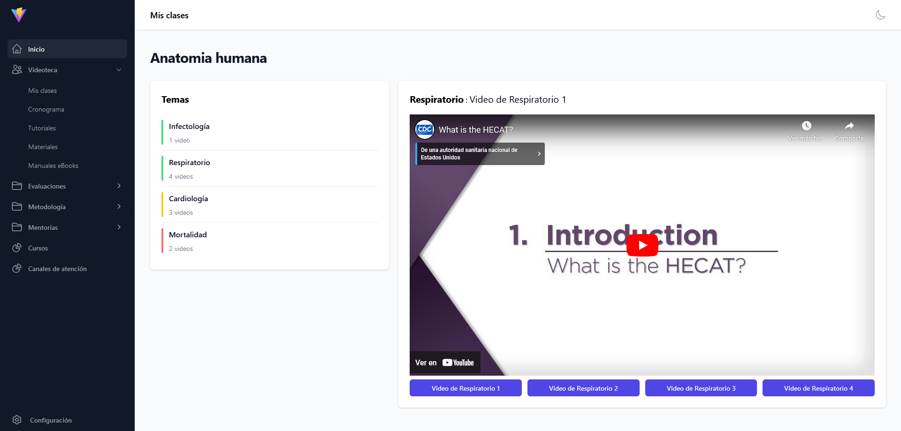

# Aula Virtual - Frontend

Este proyecto es una interfaz de **Aula Virtual** desarrollada en React utilizando Vite. El objetivo principal es el diseño y desarrollo de la parte visual del sistema, sin funcionalidad backend. Se trata de un prototipo para visualizar cómo lucirá la plataforma.

## Tecnologías Utilizadas

- **React**: Biblioteca de JavaScript para construir interfaces de usuario.
- **Vite**: Herramienta de desarrollo para proporcionar un entorno rápido y eficiente en proyectos de frontend.
- **Tailwind**: Para el diseño y estilización de los componentes.
- **React Router**: Para la navegación entre vistas dentro de la aplicación.

## Capturas de Pantalla

### Vista del Dashboard


### Vista de Examen


### Vista de Resultados del Examen


### Vista del Curso


### Vista de Estadísticas de Mentorías


Para ver más capturas de pantalla, puedes explorar la carpeta  dentro del repositorio.

## Instalación

Sigue estos pasos para ejecutar el proyecto localmente:

1. Clona este repositorio:

```bash
git clone https://github.com/Polarsh/aula-virtual-front.git
```

2. Navega al directorio del proyecto:

```bash
cd aula-virtual-front
```

3. Instala las dependencias:

```bash
npm install
```

4. Inicia el servidor de desarrollo:

```bash
npm run dev
```

5. Abre el navegador en `http://localhost:5173` para ver el proyecto.

## Notas

Este proyecto es meramente un diseño para un prototipo de aula virtual, por lo tanto, no contiene lógica de negocio ni funcionalidad backend. El enfoque principal está en la presentación visual.

